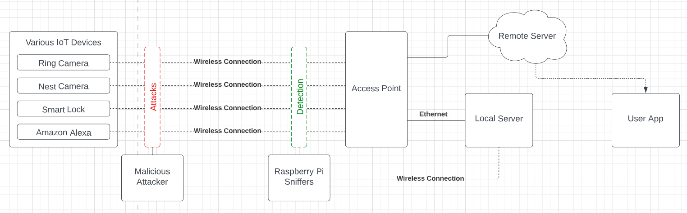

# WARN : Wi-Fi Attack Recognizer and Notifier

## Background
The attacks we focused on in this project were [KRACK](https://papers.mathyvanhoef.com/ccs2017.pdf) and [deauthentication attacks](https://www.sciencedirect.com/science/article/pii/S266682702200072X). The reason those attacks were chosen is due to their danger:
1. KRACK can break the WPA2 encryption, thus causing sensitive user data to be exposed to attackers when paired with other attacks.
2. Deauthentication is the most efficient way of taking a device offline. It can easily be performed with the use of tools such as [aireplay-ng](https://www.aircrack-ng.org/doku.php?id=aireplay-ng) or [mdk4](https://github.com/aircrack-ng/mdk4).

## Implementation
WARN is a detection system built to detect Wi-Fi attacks and inform a user of their occurrence. The systen consists of 4 different components: sniffers, a local server, a remote server and a user app. Each component has the following properties: 

- The sniffers monitor the network and detect attacks. 
- The local server performs analysis of packets and checks the status of devices on the network.
- The remote server manages user information, stores device data needed for analysis, and send push notifications.
- The user app notifes the user of attacks and provides the user with information about the network.

For more information on the implementation of the project and how to run each component, look into the README.md files provided within each directory.